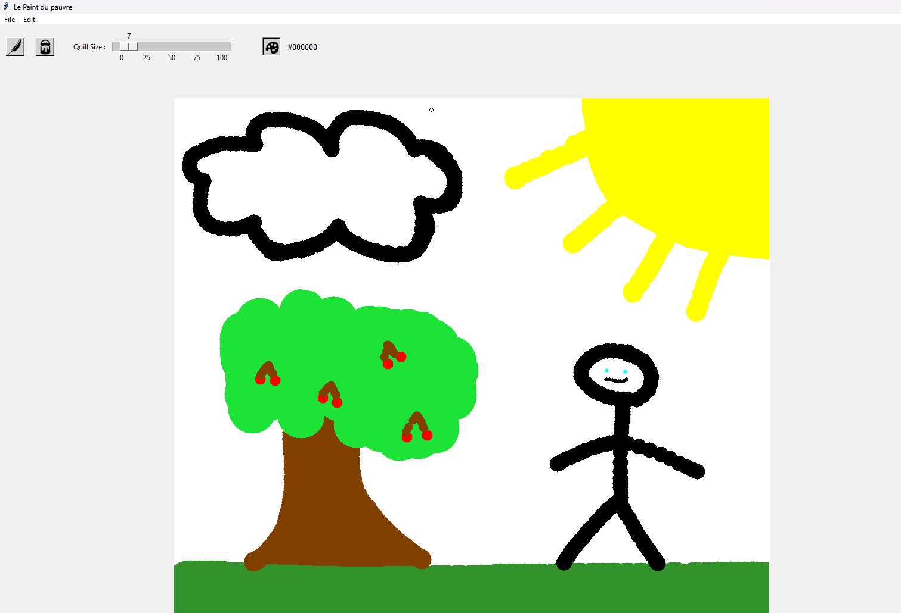

# Paint Application

Paint Application est une application de dessin simple développée en Python à l'aide de la bibliothèque Tkinter et Pillow pour la manipulation d'images.

## Fonctionnalités/Utilisation

- **Outils de dessin** : Utilisation d'un pinceau et d'un outil de remplissage pour dessiner sur un canevas.
- **Sélection de couleur** : Choix de la couleur de dessin à l'aide d'une palette de couleurs.
- **Sauvegarde et chargement d'images** : Fonctionnalités pour sauvegarder et charger des images au format JPG.
- **Nouvelle image** : Cliquez sur `File -> New` pour créer une nouvelle image avec des dimensions spécifiques.
- **Charger une image** : Utilisez `File -> Load` pour charger une image à partir de votre système de fichiers.
- **Sauvegarder une image** : Utilisez `File -> Save as` pour sauvegarder l'image actuelle sous un nouveau nom.
- **Outils de dessin** : Sélectionnez l'outil de dessin (`Quill` pour le pinceau, `Paint can` pour le remplissage) à partir de la barre d'outils.
- **Redimensionnement de l'image** : Faites glisser la poignée dans le coin inférieur droit pour redimensionner l'image.
- **Undo/Redo** : Utilisez `Edit -> Undo` et `Edit -> Redo` ou les raccourcis clavier `Ctrl+Z` et `Ctrl+Y` pour annuler et rétablir les actions de dessin.


## Présentation visuelle du projet

1. **Capture d'écran :**

    

2. **Vidéo de présentation :**

    ```bash
    insérer le lien vers la vidéo


## Prérequis

Pour exécuter l'application localement, vous aurez besoin des outils suivants installés sur votre machine :

- Python 3.x
- Tkinter
- Pillow (PIL)

## Installation et exécution

1. **Clonez le dépôt :**

   ```bash
   git clone https://github.com/votre-utilisateur/paint-application.git
   cd paint-application

2. **Installez les dépendances**

    ```bash
    pip install -r requirements.txt

3. **Exécutez le fichier principal**

    ```bash
    python Shlag_Paint GUI.py


## Répartition des points

| Hugo | Sylvain | Marine | Trung | Khai |
|-----------|-----------|-----------|-----------|-----------|
| 20 %   | 20 %   | 20 %   | 20 %   | 20 %   |

## Explication des algorithmes non triviaux

1. **Outil remplissage :**

    L'outil de remplissage utilise une version spécialisée de l'algorithme "flood fill". Cet algorithme remplace une couleur spécifique sur le canevas par une autre couleur choisie par l'utilisateur. Lorsqu'on clique sur une zone du canevas avec l'outil de remplissage activé, l'algorithme détecte la couleur de la zone cliquée et remplace cette couleur, ainsi que toutes les zones adjacentes de la même couleur, par la nouvelle couleur sélectionnée. Ce processus se poursuit jusqu'à ce que toutes les zones connectées de la couleur d'origine soient remplies.

2. **Conversion en ASCII :**

    Insérer explication

3. **Undo & Redo :**

    Insérer explication


## Contribuer

Les contributions sont les bienvenues ! Si vous souhaitez améliorer l'application Paint, veuillez ouvrir une issue pour discuter des changements proposés.